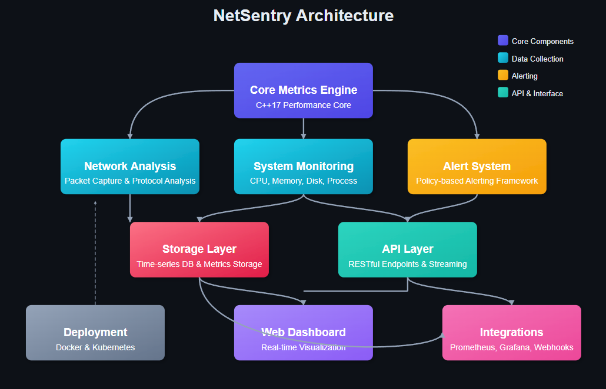

# NetSentry

<div align="center">
  <!--  -->

[](https://github.com/muhkartal/netsentry/actions)
[](https://hub.docker.com/r/muhkartal/netsentry)
[](LICENSE)
[](https://en.cppreference.com/w/cpp/17)
[](docs/index.md)

**Advanced Network Monitoring and Analysis System**

[Overview](#overview) • [Features](#key-features) • [Architecture](#technical-architecture) • [Installation](#getting-started) • [API](#api-documentation) • [Dashboard](#dashboard) • [Contributing](#development-and-contributing)

</div>

## Overview

NetSentry is a high-performance, extensible network monitoring system built with modern C++. It combines real-time system metrics collection, network packet analysis, and sophisticated alerting capabilities to provide comprehensive visibility into your network infrastructure.

<!-- <div align="center">
  
</div> -->

## Key Features

<div align="center">
<table>
  <tr>
    <th width="50%">Feature</th>
    <th width="50%">Description</th>
  </tr>
  <tr>
    <td><strong>Advanced System Monitoring</strong></td>
    <td>
      • Real-time CPU, memory, and disk metrics<br>
      • Process-level resource tracking<br>
      • Performance trend analysis
    </td>
  </tr>
  <tr>
    <td><strong>Deep Network Analysis</strong></td>
    <td>
      • Packet capture and inspection<br>
      • Protocol detection (HTTP, DNS, TLS)<br>
      • Traffic pattern recognition<br>
      • Connection tracking
    </td>
  </tr>
  <tr>
    <td><strong>Sophisticated Alert System</strong></td>
    <td>
      • Configurable thresholds and conditions<br>
      • Multi-channel notifications<br>
      • Alert correlation and grouping
    </td>
  </tr>
  <tr>
    <td><strong>Powerful Visualization</strong></td>
    <td>
      • Real-time dashboards<br>
      • Historical metrics exploration<br>
      • Network traffic graphs<br>
      • Prometheus/Grafana integration
    </td>
  </tr>
  <tr>
    <td><strong>Modern API Architecture</strong></td>
    <td>
      • RESTful API with comprehensive endpoints<br>
      • Real-time data streaming<br>
      • Seamless third-party integration
    </td>
  </tr>
  <tr>
    <td><strong>Enterprise-Grade Deployment</strong></td>
    <td>
      • Docker containerization<br>
      • Kubernetes orchestration<br>
      • High-availability configurations<br>
      • Horizontal scaling support
    </td>
  </tr>
</table>
</div>

## Technical Architecture

<picture>
  <source media="(prefers-color-scheme: dark)" srcset="images/dark-mode.png">
  <source media="(prefers-color-scheme: light)" srcset="images/light-mode.png">
  
</picture>
NetSentry leverages cutting-edge C++17 features and software design principles:

-  **Core Metrics Engine**: High-performance time-series metrics collection
-  **Network Analysis Module**: Deep packet inspection and protocol analysis
-  **Custom Memory Management**: Optimized memory pools and allocators
-  **Thread-Safe Concurrency**: Lock-free algorithms and robust synchronization
-  **Pluggable Alert System**: Policy-based design for flexible alerting
-  **Data Storage Layer**: Configurable retention and storage backends
-  **RESTful API Layer**: Modern API for data access and control
-  **Web Dashboard**: Real-time visualization interface

## Performance Benchmarks

<div align="center">
<table>
  <tr>
    <th>Metric</th>
    <th>Value</th>
    <th>Conditions</th>
  </tr>
  <tr>
    <td>Packet processing rate</td>
    <td>2.4M packets/sec</td>
    <td>Single thread, 10GbE interface</td>
  </tr>
  <tr>
    <td>CPU overhead</td>
    <td>< 3% per core</td>
    <td>Intel Xeon E5-2680v4</td>
  </tr>
  <tr>
    <td>Memory usage</td>
    <td>~120MB base + ~2GB/10Gbps</td>
    <td>Full packet capture enabled</td>
  </tr>
  <tr>
    <td>Storage efficiency</td>
    <td>~200MB/day/host</td>
    <td>Default metrics collection</td>
  </tr>
  <tr>
    <td>Alert latency</td>
    <td>< 500ms</td>
    <td>From event trigger to notification</td>
  </tr>
</table>
</div>

## Getting Started

### Quick Start with Docker

The easiest way to get started with NetSentry is using Docker:

```bash
# Clone the repository
git clone https://github.com/muhkartal/netsentry.git
cd netsentry

# Run the installation script
chmod +x install.sh
./install.sh
```

This will set up NetSentry with Prometheus and Grafana for a complete monitoring stack.

### Manual Installation

<details>
<summary><strong>Click to expand installation instructions</strong></summary>

#### Prerequisites

-  C++17 compatible compiler (GCC 8+, Clang 7+)
-  CMake 3.14+
-  libpcap development libraries
-  Boost libraries (system, filesystem)

#### Building from Source

```bash
# Clone the repository
git clone https://github.com/muhkartal/netsentry.git
cd netsentry

# Create build directory
mkdir build && cd build

# Configure and build
cmake ..
make -j$(nproc)

# Install (optional)
sudo make install
```

#### Verifying Installation

After installation, verify that NetSentry is running correctly:

```bash
# Check service status
netsentry --version
netsentry --check-config

# Start the service
netsentry --config /path/to/config.yaml
```

</details>

### Kubernetes Deployment

<details>
<summary><strong>Click to expand Kubernetes deployment instructions</strong></summary>

For production environments, we provide Kubernetes manifests:

```bash
# Apply Kubernetes configuration
kubectl apply -f kubernetes/deployment.yaml

# Check deployment status
kubectl get pods -l app=netsentry

# Verify services are running
kubectl get services -l app=netsentry

# Access the dashboard
kubectl port-forward svc/netsentry-dashboard 9090:9090
```

For high-availability deployment, see [kubernetes/ha-deployment.yaml](kubernetes/ha-deployment.yaml).

</details>

## Configuration

NetSentry uses YAML for configuration. The default configuration file is located at `configs/netsentry.yaml`:

```yaml
# Example configuration
log_level: "info"
enable_api: true
api_port: 8080
enable_web: true
web_port: 9090
enable_packet_capture: true
capture_interface: "eth0"
```

<details>
<summary><strong>Click to expand advanced configuration options</strong></summary>

### Advanced Configuration

```yaml
# Storage configuration
storage:
   type: "prometheus" # Options: prometheus, influxdb, local
   retention_days: 30
   local_path: "/var/lib/netsentry/data"
   remote_url: "http://prometheus:9090"

# Network analysis configuration
network_analysis:
   capture_interfaces: ["eth0", "eth1"]
   bpf_filter: "not port 22"
   capture_snaplen: 96
   enable_protocol_detection: true
   enable_geolocation: true
   protocols:
      - http
      - dns
      - tls
      - smtp

# Alert configuration
alerts:
   config_path: "/etc/netsentry/alerts/"
   notification_channels:
      - type: "email"
        recipients: ["admin@example.com"]
      - type: "webhook"
        url: "https://hooks.slack.com/services/XXX/YYY/ZZZ"
      - type: "prometheus-alertmanager"
        url: "http://alertmanager:9093/api/v1/alerts"

# Performance tuning
performance:
   threads: 4 # 0 = auto-detect
   packet_batch_size: 1024
   use_zero_copy: true
   memory_limit_mb: 2048
   enable_lock_free_queues: true
```

</details>

See the [Configuration Guide](docs/CONFIGURATION.md) for complete documentation.

## Usage Examples

### Monitoring System Resources

NetSentry automatically collects CPU, memory, and disk metrics out of the box:

```bash
# View real-time system metrics
curl http://localhost:8080/api/v1/metrics
```

<details>
<summary><strong>Example Response</strong></summary>

```json
{
   "timestamp": "2023-07-25T15:21:33Z",
   "host": "server-prod-01",
   "metrics": {
      "cpu": {
         "usage_percent": 23.5,
         "load_avg_1m": 1.23,
         "load_avg_5m": 1.15,
         "load_avg_15m": 0.98,
         "core_count": 8,
         "temperature_celsius": 42.3
      },
      "memory": {
         "total_bytes": 17179869184,
         "used_bytes": 8203091968,
         "used_percent": 47.75,
         "swap_used_percent": 5.12
      },
      "disk": {
         "total_bytes": 1099511627776,
         "used_bytes": 351383035904,
         "used_percent": 31.96,
         "inodes_used_percent": 14.32,
         "io_utilization_percent": 2.1
      }
   }
}
```

</details>

### Analyzing Network Traffic

Enable packet capture to analyze network traffic:

```bash
# Start NetSentry with packet capture
./netsentry --interface eth0
```

<details>
<summary><strong>View Top Connections</strong></summary>

```bash
# Get top connections by traffic volume
curl http://localhost:8080/api/v1/network/connections?limit=5

# Response
{
  "timestamp": "2023-07-25T15:24:45Z",
  "connections": [
    {
      "source_ip": "192.168.1.105",
      "source_port": 49321,
      "dest_ip": "172.217.20.110",
      "dest_port": 443,
      "protocol": "TCP",
      "bytes_tx": 1532842,
      "bytes_rx": 25437219,
      "packets_tx": 12392,
      "packets_rx": 18329,
      "duration_sec": 293.4,
      "state": "ESTABLISHED",
      "application_protocol": "HTTPS"
    },
    ...
  ]
}
```

</details>

### Setting Up Alerts

Create alerts for important metrics:

```bash
# Create a high CPU usage alert via the API
curl -X POST http://localhost:8080/api/v1/alerts \
  -H "Content-Type: application/json" \
  -d '{
    "name": "High CPU Usage",
    "metric": "cpu.usage",
    "comparator": "gt",
    "threshold": 90.0,
    "severity": "warning"
  }'
```

<details>
<summary><strong>Advanced Alerting Example</strong></summary>

```bash
# Create a complex alert with multiple conditions
curl -X POST http://localhost:8080/api/v1/alerts \
  -H "Content-Type: application/json" \
  -d '{
    "name": "Potential Port Scan",
    "description": "Detects potential port scanning activity",
    "conditions": [
      {
        "metric": "network.connection_count",
        "filter": "src_ip = $src_ip",
        "comparator": "gt",
        "threshold": 100,
        "time_range": "60s"
      },
      {
        "metric": "network.unique_dest_port_count",
        "filter": "src_ip = $src_ip",
        "comparator": "gt",
        "threshold": 20,
        "time_range": "60s"
      }
    ],
    "condition_logic": "AND",
    "severity": "critical",
    "throttle_sec": 300,
    "notifications": [
      {
        "type": "email",
        "recipients": ["security@example.com"]
      },
      {
        "type": "webhook",
        "url": "https://example.com/security-alerts"
      }
    ]
  }'
```

</details>

## API Documentation

NetSentry provides a comprehensive REST API for integration with other systems. Here are some key endpoints:

<div align="center">
<table>
  <tr>
    <th>Endpoint</th>
    <th>Method</th>
    <th>Description</th>
  </tr>
  <tr>
    <td><code>/api/v1/metrics</code></td>
    <td>GET</td>
    <td>List all available metrics</td>
  </tr>
  <tr>
    <td><code>/api/v1/network/connections</code></td>
    <td>GET</td>
    <td>List active network connections</td>
  </tr>
  <tr>
    <td><code>/api/v1/network/hosts</code></td>
    <td>GET</td>
    <td>List top hosts by traffic</td>
  </tr>
  <tr>
    <td><code>/api/v1/alerts</code></td>
    <td>GET/POST</td>
    <td>Manage alerts</td>
  </tr>
  <tr>
    <td><code>/api/v1/capture</code></td>
    <td>POST</td>
    <td>Control packet capturing</td>
  </tr>
  <tr>
    <td><code>/api/v1/config</code></td>
    <td>GET/PUT</td>
    <td>View and update configuration</td>
  </tr>
</table>
</div>

For complete API documentation, see [API.md](docs/API.md).

### Terminal Output

NetSentry provides comprehensive monitoring information directly in the terminal:

```
$ ./netsentry --interface eth0 --api-enable --web-enable

[2025-04-26 14:32:10] [INFO] NetSentry v1.0.0 starting up...
[2025-04-26 14:32:10] [INFO] Thread pool initialized with 8 threads
[2025-04-26 14:32:10] [INFO] Database initialized: sqlite
[2025-04-26 14:32:10] [INFO] System collectors started
[2025-04-26 14:32:10] [INFO] Capturing packets on interface: eth0
[2025-04-26 14:32:10] [INFO] REST API server started on port 8080
[2025-04-26 14:32:10] [INFO] Web dashboard started on port 9090
[2025-04-26 14:32:10] [INFO] NetSentry is running. Press Ctrl+C to exit.

NetSentry - Network Monitoring Tool
==================================

System Metrics:
--------------
cpu.usage                     : 72.30
cpu.core.0.usage              : 68.42
cpu.core.1.usage              : 76.15
cpu.core.2.usage              : 75.84
cpu.core.3.usage              : 69.03
memory.total                  : 16384.00
memory.used                   : 10617.86
memory.free                   : 5766.14
memory.usage_percent          : 64.80

Network Statistics:
------------------
Packets captured: 14528
Bytes captured: 26853421

Top Connections:
1. 192.168.1.105:48329 -> 35.214.152.91:443 [TLS]
   Sent: 1342 packets, 286421 bytes | Received: 2156 packets, 24531642 bytes
2. 192.168.1.105:45129 -> 172.217.169.36:443 [TLS]
   Sent: 842 packets, 156214 bytes | Received: 1024 packets, 15124536 bytes
3. 192.168.1.107:52415 -> 104.26.10.233:443 [TLS]
   Sent: 645 packets, 124532 bytes | Received: 782 packets, 12653214 bytes
4. 192.168.1.110:59812 -> 13.107.42.14:443 [TLS]
   Sent: 421 packets, 86421 bytes | Received: 512 packets, 8653215 bytes
5. 192.168.1.105:47291 -> 34.107.221.82:443 [TLS]
   Sent: 312 packets, 65421 bytes | Received: 386 packets, 6325421 bytes

Top Hosts by Traffic:
1. 35.214.152.91: 24818063 bytes
2. 172.217.169.36: 15280750 bytes
3. 104.26.10.233: 12777746 bytes
4. 13.107.42.14: 8739636 bytes
5. 34.107.221.82: 6390842 bytes

Thread pool queue size: 0
```

The dashboard provides:

-  Real-time metrics visualization
-  Network connection tables
-  Protocol distribution charts
-  Alert management interface

## Development and Contributing

We welcome contributions from the community! See [CONTRIBUTING.md](docs/CONTRIBUTING.md) for guidelines.

### Development Setup

```bash
# Set up development environment
git clone https://github.com/muhkartal/netsentry.git
cd netsentry

# Install dev dependencies
./scripts/install_dev_deps.sh

# Build with tests enabled
mkdir build && cd build
cmake -DBUILD_TESTS=ON ..
make -j$(nproc)

# Run tests
ctest
```

### Project Troubleshooting

<details>
<summary><strong>Click to view our development troubleshooting</strong></summary>

#### Current Quarter

-  Enhance protocol analyzers for encrypted protocols
-  Add machine learning-based anomaly detection
-  Improve dashboard visualizations

#### Future Development

-  Native eBPF support for Linux
-  Custom DSL for network pattern matching
-  Mobile companion app
-  Cloud service integration
-  Extended API capabilities

</details>

For more information about upcoming features and development plans, see our [TROBULESHOOTING.md](docs/TROBULESHOOTING.md).

## License

NetSentry is released under the MIT License. See [LICENSE](LICENSE) for details.

## Acknowledgements

-  [libpcap](https://www.tcpdump.org/) for packet capture functionality
-  [Boost C++ Libraries](https://www.boost.org/) for networking components
-  [Prometheus](https://prometheus.io/) for metrics storage
-  [Grafana](https://grafana.com/) for metrics visualization

---

<div align="center">
  <p>
    <strong>NetSentry</strong> - Advanced Network Monitoring in Modern C++
  </p>
  <p>
    <a href="https://github.com/muhkartal/netsentry">GitHub</a> •
    <a href="https://hub.docker.com/r/muhkartal/netsentry">Docker Hub</a> •
    <a href="docs/API.md">API Docs</a> •
    <a href="https://kartal.dev/">Developer Website</a>
  </p>
</div>
<div align="center">

Developed by Muhammad Ibrahim Kartal | [kartal.dev](https://kartal.dev)

</div>
